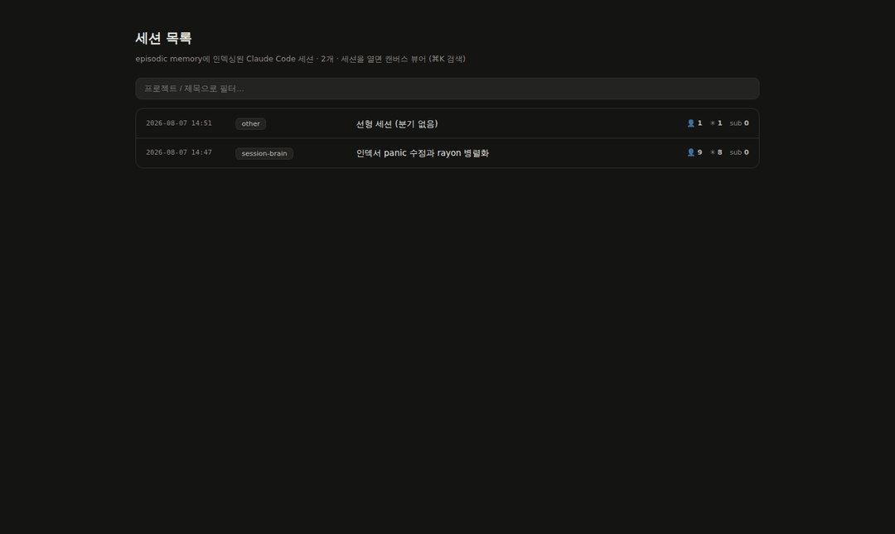
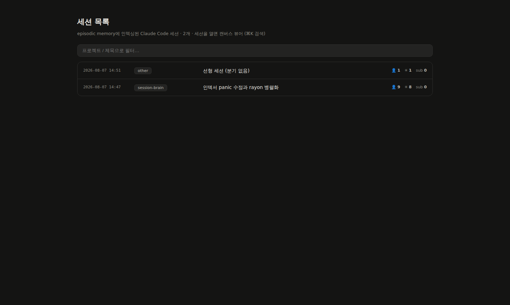
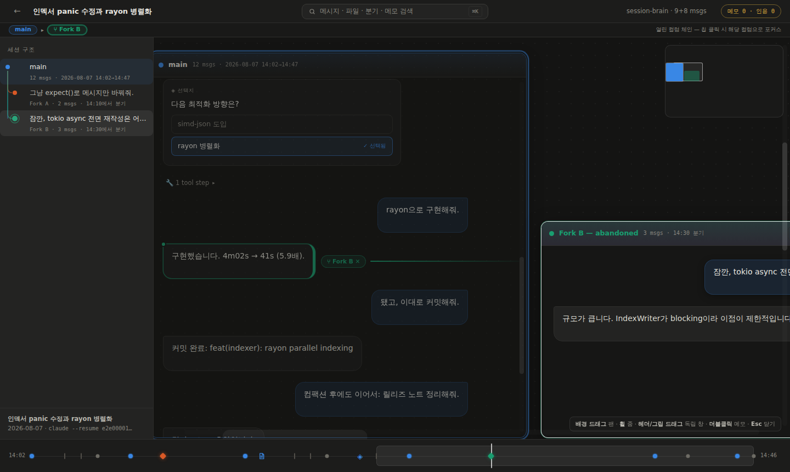
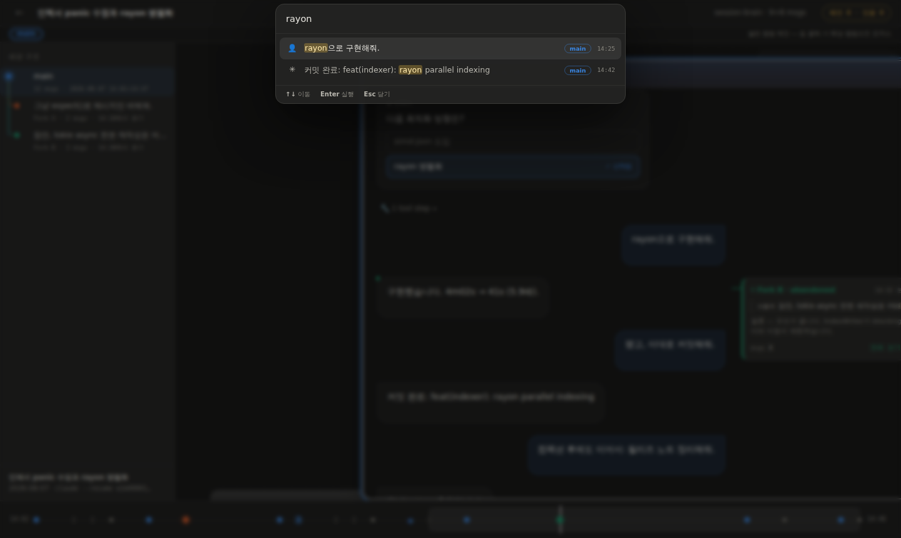
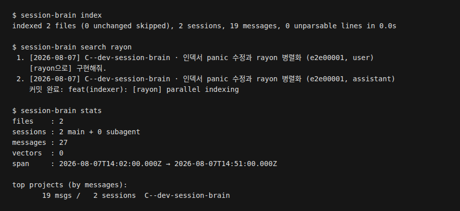

# session-brain

Claude Code 세션 로그를 로컬 SQLite에 색인하고, CLI(Command-Line Interface), MCP(Model Context Protocol) 서버, 웹 UI(User Interface), Obsidian 보관함에서 검색하고 열람하는 도구입니다.

**한국어** | [English](README.en.md)



| 세션 목록 | 분기(fork) 컬럼 | 명령 팔레트 |
|---|---|---|
|  |  |  |



모든 화면은 `web/test/gen-corpus.mjs`가 만든 합성 데이터로 실제 바이너리를 실행해 캡처했습니다.

## 주요 기능

- **세션 색인**: `~/.claude/projects` 아래의 JSONL(JSON Lines) 로그를 읽어 `~/.session-brain/index.db`에 SQLite 캐시로 저장합니다. 새로 생기거나 바뀐 파일만 다시 읽고, `index --full`은 전체를 다시 만듭니다. 서브에이전트 기록도 따로 구분해 색인합니다.
- **검색**: 세 단계를 차례로 실행합니다.
  1. SQLite FTS5(Full-Text Search 5) 검색, bm25(Best Matching 25) 순위
  2. 선택 사항: 로컬 Ollama 임베딩으로 의미 검색을 하고, 1단계 결과와 RRF(Reciprocal Rank Fusion)로 합칩니다.
  3. 문자열 부분 일치 검색. 한국어 복합어나 식별자 안의 일치도 찾고, 전체 일치 건수를 함께 보여 줍니다.
- **분기 추적**: 모든 줄의 `parentUuid` 연결을 저장하므로 메시지 수정이나 재시도로 버려진 분기까지 복원합니다.
- **웹 UI** (`serve`): 세션 목록, 무한 캔버스 뷰어, 사이드바의 분기 트리, 분기 컬럼, 타임라인, 코드 창, 명령 팔레트(`⌘K`), 더블클릭 메모(브라우저 localStorage에 저장)를 제공합니다.
- **MCP 서버** (`mcp`): 표준 입출력으로 도구 세 개를 제공해 Claude가 지난 세션을 직접 찾아보게 합니다. `sessions_search`, `sessions_get`, `sessions_recent`
- **Obsidian 내보내기** (`export`): `Sessions/`, `Projects/`, `Home.md`, `sessions.base`를 새로 만듭니다.
- **터미널 열람**: `show`는 대화 내용과 `claude --resume` 명령을, `stats`는 색인 통계를 출력합니다.

## 사용 방법

### 1. 설치

Rust 툴체인(Cargo)이 필요합니다. 웹 UI는 `assets/app.html`로 미리 빌드되어 바이너리에 포함되므로 Node.js는 없어도 됩니다.

```sh
git clone https://github.com/patissierMongs/session-brain
cd session-brain
cargo install --path .
```

### 2. 색인 만들기

```sh
session-brain index                 # ~/.claude/projects 스캔
session-brain index --full          # 전체 재색인
session-brain index --root <DIR>    # 다른 디렉터리 스캔
session-brain stats
```

데이터베이스 위치는 전역 옵션 `--db <PATH>`로 바꿀 수 있습니다.

### 3. 검색과 열람

```sh
session-brain search "그때 고친 버그"
session-brain search -p <project> -r user -n 10 rayon
session-brain show <세션 ID(식별자) 앞부분>
```

`-p`는 프로젝트/작업 디렉터리 부분 문자열, `-r`은 역할(`user` 또는 `assistant`), `-n`은 결과 개수로 거릅니다. `-a`를 주면 서브에이전트 기록도 포함합니다.

### 4. 웹 UI

```sh
session-brain serve                 # http://localhost:7777
session-brain serve --port 8080
```

127.0.0.1에만 바인딩합니다. 목록에서 세션을 누르면 캔버스 뷰어가 열리고, 분기 카드를 누르면 분기 컬럼이 열립니다. `⌘K` 또는 상단 검색창으로 팔레트를 엽니다.

### 5. 의미 검색 (선택)

로컬에서 [Ollama](https://ollama.com)가 실행 중이어야 합니다.

```sh
ollama pull qwen3-embedding:8b
session-brain embed                 # 증분 처리, 여러 번 실행해도 됩니다
session-brain search -s "storage full error"
```

`embed`와 `search`는 `--model`, `--url` 옵션을 받습니다. MCP 서버와 웹 API(Application Programming Interface)는 환경 변수 `SESSION_BRAIN_EMBED_MODEL`, `SESSION_BRAIN_OLLAMA_URL`을 읽습니다(기본값 `qwen3-embedding:8b`, `http://localhost:11434`). Ollama에 연결하지 못하면 1, 3단계 검색 결과만 돌려줍니다.

### 6. MCP 서버 등록

```sh
claude mcp add session-brain -s user -- session-brain mcp
```

### 7. Obsidian 내보내기

```sh
session-brain export --vault ~/Obsidian/SessionBrain
```

보관함의 생성 파일은 실행할 때마다 다시 만들어지므로 직접 고치지 않습니다.

### 웹 UI 개발

```sh
cd web
npm install
npm run dev       # Vite 개발 서버
npm run check     # TypeScript 타입 검사
npm run build     # ../assets/app.html 생성
```

`cargo install`만으로 설치되도록 `assets/app.html`을 저장소에 커밋해 둡니다.

E2E(End-to-End) 테스트는 실행 중인 서버에 Playwright로 접속합니다.

```sh
node web/test/gen-corpus.mjs /tmp/sb-projects
session-brain --db /tmp/sb.db index --root /tmp/sb-projects
session-brain --db /tmp/sb.db serve --port 7791 &
node web/test/e2e.mjs               # BASE 기본값 http://localhost:7791
```

`e2e.mjs`는 `playwright` 패키지를 불러오고 `/opt/pw-browsers/chromium`의 Chromium을 실행하므로 환경에 맞게 조정합니다.

### MSVC 없이 Windows에서 빌드

MSVC(Microsoft Visual C++) Build Tools가 없으면 GNU(GNU's Not Unix) 툴체인으로 빌드합니다. 아래 두 파일을 로컬에만 만듭니다(둘 다 gitignore 대상입니다).

`rust-toolchain.toml`
```toml
[toolchain]
channel = "stable-x86_64-pc-windows-gnu"
```

`.cargo/config.toml`
```toml
[build]
target = "x86_64-pc-windows-gnu"

[target.x86_64-pc-windows-gnu]
linker = "C:\\msys64\\ucrt64\\bin\\gcc.exe"
```

## 기술 스택

| 영역 | 구성 |
|---|---|
| 언어 | Rust (edition 2021), TypeScript, JavaScript |
| CLI | clap 4 (derive) |
| 저장 / 검색 | rusqlite 0.37 (SQLite 내장 빌드, FTS5), sha2 0.10 |
| 웹 서버 | axum 0.8, tokio 1 |
| MCP | rmcp 1 (stdio 전송), schemars 1 |
| 임베딩 | ureq 2로 Ollama HTTP(HyperText Transfer Protocol) API 호출, 기본 모델 `qwen3-embedding:8b` |
| 웹 UI | Vite 6, vite-plugin-singlefile 2, TypeScript 5, highlight.js 11 |
| 테스트 | Playwright E2E 스크립트 (`web/test/e2e.mjs`) |

## 문서

- [진행 기록](docs/PROGRESS.md) ([English](docs/PROGRESS.en.md))

## 라이선스

MIT(Massachusetts Institute of Technology) 라이선스. [LICENSE](LICENSE)를 참고합니다.
